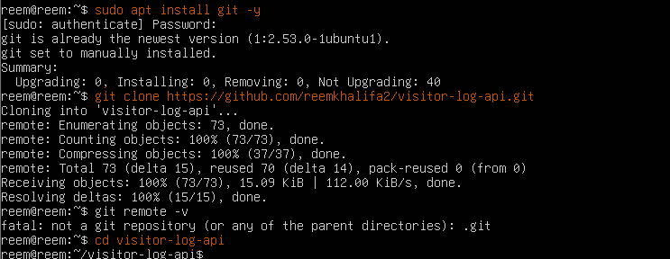
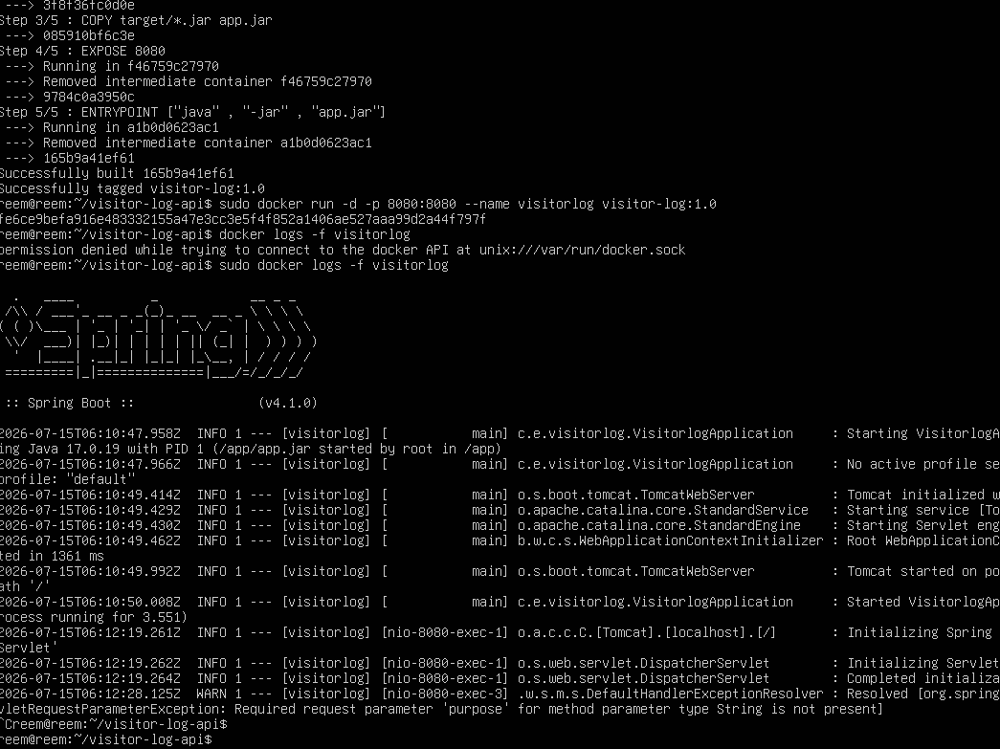

# Visitor Log API

## Project Description

Visitor Log API is a Spring Boot RESTful application that manages visitor records.  
The API allows users to create, retrieve, update, and delete visitor information.

The project demonstrates:
- Spring Boot REST API development
- JPA/Hibernate database integration
- CRUD operations
- Repository and Service layers
- RESTful endpoint design

---

## Technologies Used

- Java 17
- Spring Boot
- Spring Web
- Spring Data JPA
- Hibernate
- Maven
- Database (H2/MySQL depending on configuration)

---

## Project Structure

```
src/main/java
 └── com.example.visitorlog
      ├── controller   # REST API controllers
      ├── service      # Business logic
      ├── repository   # Database access layer
      └── model        # Entity classes
```

---

## API Endpoints

### Visitor APIs

| Method | Endpoint | Description |
|--------|----------|-------------|
| GET | `/api/visitors` | Get all visitors |
| GET | `/api/visitors/{id}` | Get visitor by ID |
| POST | `/api/visitors` | Create a new visitor |
| PUT | `/api/visitors/{id}` | Update visitor information |
| DELETE | `/api/visitors/{id}` | Delete a visitor |

## How to Run the Project

### 1. Clone the repository

```bash
git clone <Repo-URL>
```

### 2. Navigate to the project folder

```bash
cd visitor-log-api
```

### 3. Build the project

```bash
mvn clean install
```

### 4. Run the application

```bash
mvn spring-boot:run
```

The application will start on:

```
http://localhost:8080
```

---

## Running the JAR File

After building:

```bash
java -jar target/visitor-log-api.jar

## Install docker in VM

### Create image and run the container
